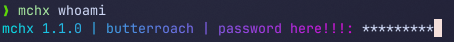
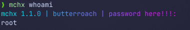

# mochaexec

## sudo if it was actually good

***

mochaexec (mchx) is an open-source, fancy-looking sudo alternative. Written
in memory-safe Rust, it uses PAM for native, secure authentication, allowing
you to temporarily run commands as the root user, without any worries about
malicious actors. In addition, mochaexec contains unprofessional messages
that add personality to your work environment, without compromising on
functionality.

### How to install?

Do not grab the binary from the release and shove it into /opt. Do not grab
the binary from the release and shove it into /opt. Do not grab the binary
from the release and shove it into /opt. Do NOT grab the binary from the
release and shove it into /opt. DO NOT GRAB THE BINARY FROM THE RELEASE A

Installing mochaexec is quite easy! Simply run
`curl -fsSL https://raw.githubusercontent.com/Butterroach/mochaexec/refs/heads/master/src/installer.py -o mochaexec_installer.py && sudo python3 mochaexec_installer.py && rm mochaexec_installer.py`
and wait.

Afterwards, you can try running `mchx whoami` to confirm if it works.
mochaexec installs in `/bin/mchx` by default, and its config files are available in `/etc/mochaexec.d`.

### How do I run it as root?

Can you log into the root account?

#### No

Do you already have sudo?

#### No

I don't know.

#### You suck

It's not my fault your system is broken.

### How do I update it?

Just reinstall it. You won't lose any data IF YOU UPDATE THE INSTALLER SCRIPT TOO OH MY GOD DON'T JUST USE THE OLD
SCRIPT

### I'm an actual Rust programmer and I read the code. It's obvious you don't know what you're doing.

shut up

# Conclusion

sudo sucks. Use mochaexec.
